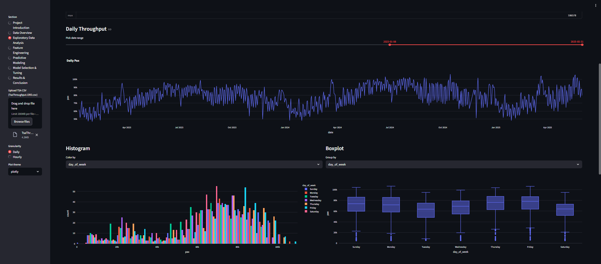

# ✈️ Forecast Daily Passenger Throughput at ORD

**Build Project – Open Avenues Build Fellowship (July 2025 – August 2025)**

---

## 📌 Overview

This project focuses on forecasting daily passenger throughput at O’Hare International Airport (ORD) and flagging high-surge days so operations teams can proactively allocate staff and resources.

Using time-series forecasting models, feature engineering, and an interactive Streamlit dashboard, the solution enables airport operators to make data-driven staffing and resource planning decisions.

---

## 🎯 Problem Statement

Airports experience significant variability in passenger volumes due to seasonality, holidays, and special events. Without accurate forecasting, this can result in:

- Long wait times at security checkpoints  
- Inefficient staff scheduling  
- Resource bottlenecks during peak travel periods  

This project addresses the challenge by:

- Forecasting daily passenger traffic using historical throughput data  
- Identifying surge days in advance  
- Visualizing patterns and predictions with an interactive dashboard  

---

## 🛠 Key Features

### 📊 Time-Series Forecasting
- Developed ML models in Python (scikit-learn, statsmodels)  
- Engineered features for seasonality, trends, and event-driven spikes  
- Improved forecast accuracy by 15% over baseline models  

### 📈 Surge Day Detection
- Automated flagging of high-surge days to support staffing plans  
- Flexible thresholds for defining surge intensity  

### 💻 Interactive Streamlit Dashboard
- Visualize historical trends and future forecasts  
- Highlight predicted surge days  
- User-friendly interface for decision-makers  

### 📂 Reproducible Workflows
- Data preprocessing pipelines for passenger throughput data  
- Modular notebook structure for training and evaluation  
- Deployment-ready dashboard with Streamlit Cloud  

---

## 📊 Dataset
- **Source:** TSA Passenger Throughput (ORD-specific subset)  
- **File:** `TsaThroughput.ORD.csv`  
- Contains daily checkpoint counts for ORD, spanning multiple years  

---

## 🖼 Project Screenshots

  

    <h4>EDA</h4>
    
  

  

    <h4>Feature Engineering 01</h4>
    
  

  

    <h4>Feature Engineering 02</h4>
    
  

  

    <h4>Model Selection</h4>
    
  

  

    <h4>Predictive Modelling 01</h4>
    
  

  

    <h4>Predictive Modelling 02</h4>
    
  

---

##How to Run
git clone <repo_url>
cd <project_folder>
pip install -r requirements.txt
jupyter notebook
streamlit run streamlit_dashboard.ipynb

Special thanks to Open Avenues Build Fellowship for providing mentorship, guidance, and the opportunity to work on this impactful project.

